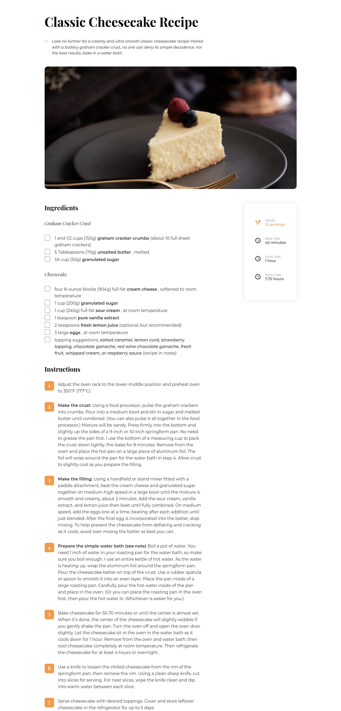

<!-- Please update value in the {}  -->

<h1 align="center">Recipe Page</h1>

   Solution for a challenge from  <a href="http://devchallenges.io" target="_blank">Devchallenges.io</a>.

  <h3>
    <a href="https://tatranan.github.io/RecipePage-DevChallenge/">
      Demo
    </a>
     | 
    <a href="https://github.com/tatranan/RecipePage-DevChallenge">
      Solution
    </a>
     | 
    <a href="https://devchallenges.io/challenges/OEKdUZ6xs0h99C38XVht">
      Challenge
    </a>
  </h3>

<!-- TABLE OF CONTENTS -->

## Table of Contents

- [Overview](#overview)
  - [Built With](#built-with)
- [Features](#features)
- [How to use](#how-to-use)
- [Contact](#contact)
- [Acknowledgements](#acknowledgements)

<!-- OVERVIEW -->

## Overview

- You can see demo in [here](https://tatranan.github.io/RecipePage-DevChallenge/)
- Experience that I learn in the challenge is use flex direction, responsive

### Built With

<!-- This section should list any major frameworks that you built your project using. Here are a few examples.-->

- [CSS](https://css-tricks.com/)

## Features

<!-- List the features of your application or follow the template. Don't share the figma file here :) -->

This application/site was created as a submission to a [DevChallenges](https://devchallenges.io/challenges) challenge. The [challenge](https://devchallenges.io/challenges/TtUjDt19eIHxNQ4n5jps) was to build an application to complete the following user stories:

- [x] User story: This is a completed user stories

## Acknowledgements

<!-- This section should list any articles or add-ons/plugins that helps you to complete the project. This is optional but it will help you in the future. For exmpale -->

- [HTML <input type="checkbox">](https://www.w3schools.com/tags/att_input_type_checkbox.asp)
- [Flexbox](https://css-tricks.com/snippets/css/a-guide-to-flexbox/)
- [How to reuse styles?](https://stackoverflow.com/questions/7261823/how-to-reuse-styles)
- [Remove height in css](https://stackoverflow.com/questions/44010645/remove-height-auto-using-css)

## Contact

- GitHub [tatranan](https://github.com/tatranan)
- Youtube [Youtube](https://www.youtube.com/watch?v=g5m_d17_rA0)
